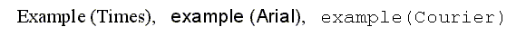

# II. **字形轮廓（Glyph Outlines）**

本节介绍 FreeType 和客户端应用程序如何使用字形图像的可扩展表示（称为轮廓）。

## **1. 像素、点和设备分辨率**

尽管这是一个十分常见的假设，对于计算机图形程序，一个给定像素的物理尺寸（无论是屏幕还是打印机）并不是方形的。通常，输出设备在水平和垂直方向上显示不同的分辨率，在渲染文本时必须注意这一点。

因此，通常通过 dpi（dots per inch 每英寸点数）表示的两个数字来定义设备的特性。例如，分辨率为 300×600 dpi的打印机，其水平方向为 300 点/英寸，垂直方向为 600 点/英寸。一个典型的计算机显示器的分辨率随其大小，当然还有图形模式分辨率而变化（10 寸和 25 寸显示器在 1024×768 图形分辨率下没有相同的像素大小）。

因此，文本的大小通常以点（pt）表示，而不是特定于设备的像素。点是一个物理单位，在数字印刷中，1点等于1/72英寸。例如，大多数使用拉丁文本的书籍的正文大小在 10 到 14 点之间。

因此，可以用点的大小计算文本的像素大小，公式如下：

> 像素大小 = 点的大小 * 分辨率 / 72

分辨率用dpi表示。由于水平和垂直分辨率可能不同，单个点的大小通常定义为以像素为单位的不同文本宽度和高度。

与人们通常认为的不同，“以像素为单位的文本大小”与字符显示或打印时的实际尺寸并没有直接关系。这两个概念之间的关系有点复杂，取决于字体设计人员所做的一些设计选择。下一小节将对此进行更详细的描述（参见 EM 正方形的解释）。

## **2. 矢量表示**

轮廓的源格式是称为轮廓线的封闭路径的集合。每条轮廓线划分字形的外部或内部区域，并且可以由线段或贝塞尔曲线组成。

曲线是通过控制点定义的，可以是二次多项式（圆锥贝塞尔曲线）或三次多项式（立方贝塞尔曲线），这取决于字体格式。注意在文献中圆锥贝塞尔曲线通常称为二次贝塞尔曲线。FreeType 将轮廓中的每个点与指示其类型的标志（普通点或控制点）关联。因此，缩放点集将缩放整个轮廓。

每个字形的原始轮廓点位于一个不可再分割的单元网格上。这些点通常以 16 位整数网格坐标的形式存储在字体文件中，网格的原点为 (0, 0)，它们的范围为 -32768 到 32767。（尽管点坐标可以是其他格式的浮点数，比如在 Type 1 中，但为了简单起见，我们将把分析限制为整数值）。

网格始终像传统的数学上的二维平面一样定向，即 X 轴从左到右，Y 轴从下到上。

在创建字形轮廓时，样式设计师使用一个称为 EM 正方形的假想正方形。通常，EM 正方形可以被认为是一个要绘制字符的写字板。正方形的大小，即其两边的网格单元数非常重要，原因有二：

* 它是用于将轮廓缩放到给定文本尺寸的参考大小。例如在 300×300 的 dpi 下，12 pt 的大小对应 12 * 300 / 72 = 50 像素。这是 EM 正方形在输出设备上显示的大小，如果它是直接渲染的（没有其他缩放、旋转等变换操作）。换句话说，网格单位到像素的缩放公式为：

	> 像素大小 = 点的大小 * 分辨率 / 72  
	> 像素坐标 = 网格坐标 * 像素大小 / EM 尺寸

	像素大小的另一个缩写是 ppem（像素每 EM），这个值也可以是浮点数。注意，浮点数 ppem 值并非在所有地方都受支持。

* EM 尺寸越大，设计者在数字化轮廓时可以使用越大的分辨率。例如，在EM 尺寸为 4 个单位的极端例子中，在 EM 正方形内只有 25 个点位置，这显然是不够的。典型的 TrueType 字体使用的 EM 尺寸为 2048 个单位；Type 1 或 CFF PostScript 字体传统上使用 1000 单位的 EM 尺寸（但是点坐标可以表示为浮点数）。

注意，如果字体设计人员需要，字形可以自由地扩展到 EM 正方形之外。EM 正方形只是传统印刷术中的一个惯例。

网格单位通常被称为字体单位或 EM 单位。

如前所述，上述公式中计算出的像素大小与屏幕上字符的大小没有直接关系。如果要显示的话，它就是 EM 正方形的大小。每个字体设计师都可以自由地按其想法将字形放置在正方形中。这就解释了为什么下列文字的不同字体的字母不具有相同的高度，即使以相同的点的大小显示：

正如你所看到的，Courier 字体族的字形 比 Times New Roman 的要小，Times New Roman本身也比 Arial 略小，尽管所有的东西都以 16 点的大小显示或印刷。

## **3. 微调（Hinting）和位图渲染**

存储在字体文件中的轮廓称为“主轮廓”，它的点坐标以字体单位表示。在将其转换为位图之前，必须将其缩放到给定的大小和分辨率。这是通过一个非常简单的转换完成的，但特别是在小尺寸时，讨厌的产物可能会出现，特别是像“E”或“H”这样的字母可能会出现不同宽度或高度的茎（stem）。

因此，正确的字形渲染需要通过一种称为网格匹配（grid-fitting，通常称为微调）的操作，使缩放的点沿着目标设备像素网格对齐。其主要目的之一是确保重要的宽度和高度在整个字体中得到重视（例如，“I”和“T”字形具有相同像素宽度的中央垂直线是非常理想的）,以及管理像茎和超调（overshoot）这样的特性，这些特性在小像素尺寸的时候会导致问题。

有几种方法可以正确地进行网格匹配，大多数可伸缩格式都将一些控制数据或控制程序与每个字形轮廓相关联。以下是概览：

* **显式网格匹配**

	TrueType 格式定义了一个基于堆栈的虚拟机，它的程序（也称为字节码）可以在200 多个操作符的帮助下编写，其中大多数与几何操作有关。因此，每个字形都由一个轮廓和控制程序组成，以按照字体设计者定义的方式执行实际的网格匹配。

* **隐式网格匹配（通常称为微调）**

	Type 1、CFF 和 CFF2 格式采用一种简单得多的方法：每个字形由一个大纲和几个称为微调的部分组成，这些微调用于描述字形的一些重要特性，如茎的存在、某些宽度规律等类似的东西。提示类型并不多，取决于最终的渲染器来解释提示以生成一个合适的轮廓。

* **自动网格匹配**

	有些格式，除了前进宽度和前进高度之类的字体指标外，每个字形轮廓并不包含控制信息。然后取决于渲染器来“猜测”轮廓中更有趣的特性，以便执行一些像样的网格拟合。

下表总结了每种方案的优缺点。

网格匹配方案 | 优点 | 缺点
:- | :- | :-
显式 | **质量**：在小尺寸的情况下也有可能取得优异的效果。这对于屏幕显示非常重要。 **一致性**：所有渲染器都产生相同的字形位图（至少理论上如此）。 | **速度**：如果字形程序很复杂，解释字节码可能会很慢。 **大小**：字形程序可能会很长。 **技术难度**：编写好的暗示程序是极其困难的。可用的工具很少。
隐式 | **大小**：微调通常比显式字符程序小得多。 **速度**：网格匹配通常是一个快速的过程。 | **质量**：在小尺寸时常常有问题。结合抗锯齿会更好。 **一致性**：不同的渲染器，甚至同一引擎的不同版本，结果可能不同。
自动 | **大小**：不需要控制信息，产生更小的字体文件。 **速度**：取决于网格匹配算法。通常比显式网格拟合更快。 | **质量**：在小尺寸时常常有问题。结合抗锯齿会更好。 **速度**：取决于网格匹配算法。 **一致性**：不同的渲染器，甚至同一引擎的不同版本，结果可能不同。
